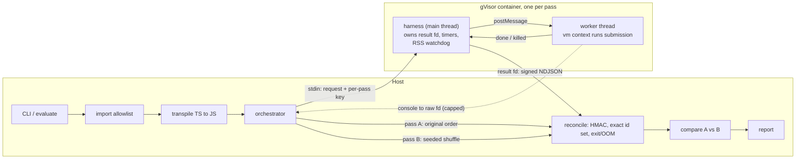

# ts-sandbox-harness

[](https://github.com/mhm655/recreate/actions/workflows/sandbox.yml)

The execution layer of a larger tool. That tool captures a real TypeScript function's behaviour as a fixed test suite, with the original implementation as the oracle, then grades a from-scratch rewrite against that suite.

This repo is **only** the sandbox and execution harness. It takes a function and a list of inputs, runs the function once per input inside an isolated sandbox, and returns each result in a lossless tagged encoding. Every failure comes back as a structured report, never as a crash or a hang of the calling process.

Out of scope here: AST analysis, LLM test generation, mutation testing, the challenge data model, the UI.

---

## Security model

Each layer has one job. Two of them are **not** security boundaries, and the code says so wherever it touches them.

| Layer | Job | Security boundary? |
|---|---|---|
| **Static import allowlist** (host) | Reject module references outside an explicit allowlist before any container exists | No. It gives early, readable errors. The global-identifier check is a best-effort blocklist and is trivially bypassed. |
| **gVisor container** (`runsc`) | Isolate untrusted code from the host kernel: no network, read-only rootfs, noexec tmpfs, non-root, `cap-drop=ALL`, `no-new-privileges`, seccomp, memory/CPU/pid cgroups | **Yes. This is the boundary.** |
| **Seccomp profile** | Allowlist of syscalls. `clone` is allowed only for threads, so nothing in the container can create a process | Yes, defence in depth under gVisor |
| **Worker thread** | *Interruptibility.* A synchronous `while(true){}` never yields, so no timer on its own thread can fire. The parent thread calls `worker.terminate()` | **No.** It shares the process, its file descriptors and its address space |
| **`vm` context** | *Realm hygiene.* Fresh intrinsics, no `require`/`process`/timers, string code generation disabled. Prototype pollution can't corrupt the encoder or message plumbing | **No.** `vm` is not a sandbox |
| **Result-channel HMAC + id reconciliation** (host) | Stop a submission from fabricating its own results | No. It protects the integrity of the *report* (see [Known limitations](#known-limitations)) |



### Why each pass gets a fresh container

Both passes run the whole test list, pass A in the original order and pass B in a seeded shuffle. Each pass gets **its own container and its own worker**, so state can't leak between passes through module scope, prototypes or the tmpfs.

Within a pass, one worker runs every test **on purpose**. Module-level counters, memo caches and prototype pollution are *meant* to persist between tests there, because that leakage is exactly what comparing the two passes detects. Any test whose outcome or post-call arguments differ between passes sets the verdict to `nondeterministic`. The report records no single answer for it.

---

## Setup

### Requirements

- Node ≥ 20 on the host (developed on Node 26)
- **A Linux host** with Docker Engine and gVisor. `runsc` doesn't run on Windows or macOS. Docker Desktop's VM doesn't support registering custom runtimes, so use a Linux machine or a Linux VM running its own `dockerd`.

### gVisor setup (one time, Linux)

1. Install `runsc` by following <https://gvisor.dev/docs/user_guide/install/>.
2. Register it with Docker **with OCI seccomp enabled**. By default gVisor *ignores* the seccomp profile passed by `docker run`. Its own syscall interception still protects the host, but `docker/seccomp.json`, including the no-process-creation rule, won't be enforced. In `/etc/docker/daemon.json`:

   ```json
   {
     "runtimes": {
       "runsc": {
         "path": "/usr/bin/runsc",
         "runtimeArgs": ["--oci-seccomp"]
       }
     }
   }
   ```

   Use the path from `which runsc`, and check the flag name against the gVisor docs for your version.
3. Restart Docker:

   ```bash
   sudo systemctl restart docker
   ```

### Bring-up check

```bash
./scripts/check-sandbox.sh
```

The script builds everything, then:
- runs `tsbox verify-isolation`, which probes the isolation claims from **inside** a container launched with the production flags: non-root, read-only rootfs, no network, process creation blocked, worker threads still working, gVisor kernel;
- runs the examples;
- runs the full hostile suite against Docker.

Run it on every new host. Misconfigured seccomp and a missing `--oci-seccomp` both **fail open**, so only this check will catch them.

### Development without gVisor

```bash
npm install
npm test
```

`npm test` uses `LocalRunner`, which runs the harness as a plain child process. **It provides no isolation.** It exists so worker termination, heap caps, the watchdog, encoding and reconciliation can all be tested on a workstation. Every report it produces is stamped `isolated: false`, and the CLI refuses it without `--unsafe-local`.

---

## Usage

```bash
npm run build
npm run image    # builds ts-sandbox-harness:latest

node dist/src/cli.js check --source examples/escape.ts
node dist/src/cli.js run   --source examples/slugify.ts --tests examples/slugify.tests.json
node dist/src/cli.js run   --source examples/counter.ts --tests examples/counter.tests.json --json
```

The test input file is plain JSON:

```json
{ "entryName": "slugify",
  "tests": [ { "id": "basic", "args": ["Hello World"] },
             { "id": "nan",   "args": ["x", "@@NaN"] } ] }
```

JSON can't express some values, so these sentinel strings stand in for them: `"@@NaN"`, `"@@Infinity"`, `"@@-Infinity"`, `"@@-0"`, `"@@undefined"`. Write `"@@@@x"` for a literal `"@@x"`. From code, call `evaluate()` with real JS values instead.

```ts
import { evaluate, DockerRunner } from 'ts-sandbox-harness';

const report = await evaluate({
  source,                                   // TypeScript
  tests: [{ id: 't1', args: [NaN, -0] }],   // real values
  runner: new DockerRunner(),
});
```

### Reading a report

`verdict` says whether the **run is valid**, not whether the function is correct. Comparing against an oracle belongs to the evaluation layer that sits on top of this one.

| verdict | meaning |
|---|---|
| `ok` | Both passes completed, reconciled cleanly and agreed. `results` holds one result per test. A test that timed out in both passes still counts as `ok`: it is consistently a timeout. |
| `nondeterministic` | Results depended on execution order. `determinism.divergences` lists each difference. `order_sensitive` is a real disagreement; `flaky_resource` means one side hit a timeout or memory cap. `results` is empty. |
| `rejected` | Static analysis or transpilation refused the source. No container was started. |
| `failed` | A pass didn't produce a trustworthy, complete result set. See each `passes[].status`. |

Pass statuses, in order of precedence: `sandbox_error`, `integrity_violation` (garbage, forged, duplicate or unexpected lines on the result channel), `resource_limit_exceeded` (container OOM, SIGKILL, host timeout), `incomplete` (missing results, no end-of-pass marker), `ok`.

Each test's `outcome` is one of:
- `return` with an encoded value
- `thrown` with `errorClass`, a normalised `message`, and `value` when a non-Error was thrown
- `timeout`
- `resource_limit` (`memory` or `worker_died`)
- `harness_error`

`argsAfterCall` is the encoded argument list *after* the call. `consoleOutput` is truncated and never part of any comparison.

---

## Limits

Limits are layered, so whichever layer trips first reports most specifically. The container is the backstop behind all of them.

| Limit | Default | Enforced by | Reported as |
|---|---|---|---|
| Per-test wall clock | 1 s | harness timer → `worker.terminate()` | outcome `timeout`; a fresh worker continues the pass |
| Per-pass wall clock | 30 s | harness timer | `sandbox_pass_timeout` problem, remaining tests missing → pass `incomplete` |
| Per-submission wall clock | 120 s | host; `docker kill` on overrun | pass `resource_limit_exceeded` / `submission_timeout` |
| Worker V8 heap | 64 MB old + 16 MB young | `resourceLimits` on the worker | outcome `resource_limit: memory` |
| Process RSS (off-heap, e.g. ArrayBuffers) | 192 MB | watchdog in harness main thread, 10 ms poll | outcome `resource_limit: memory` |
| Container memory (no swap) | 256 MB | cgroup | pass `resource_limit_exceeded` + `container_oom` |
| CPU | 1 CPU | cgroup (throttles; the timeouts catch the effect) | via timeouts |
| Tasks (threads + processes) | 128 | `--pids-limit` | seccomp already blocks processes; backstop |
| Console capture | 8 KB/test, 256 KB raw | harness | truncated with a marker |
| Result payload | 8 MB | host reader + parser | `result_channel_truncated` → pass not `ok` |
| Encoded value size | 20k nodes, depth 32, 16 KB strings | encoder | `{t:'truncated'}` markers |
| Source size | 256 KB | import guard | `source-too-large` |

The container memory limit sits above the RSS watchdog, and the watchdog above the V8 heap cap, so the most specific layer trips first. Under gVisor, sentry overhead counts against the cgroup. If legitimate runs get OOM-killed, raise `--memory-mb` and keep `maxProcessRssMb` below it.

---

## Design notes

### Result channel

- **Separate descriptor.** Results never share a descriptor with untrusted console output. Locally the harness writes results to a real fd 3 and console to fd 1. `docker run` forwards exactly three descriptors, so in the container results go on fd 1 and all worker stdio goes to fd 2 (`SANDBOX_RESULT_FD=1`). In both cases only the trusted main thread writes to the result descriptor.
- **Signed lines.** Each line is `<hmac-sha256> <json>`. The key is fresh for each pass, arrives on stdin, and lives only in the main thread's JS heap: never in env, `workerData` or on disk. The worker can still write to the fd, because fds are process-wide. It can't sign what it writes.
- **Minimal parsing.** The host uses plain `JSON.parse` under a byte cap and nothing more capable. A partial final line from a container killed mid-write counts as truncation, not tampering.
- **Exact reconciliation.** The returned test-id set must match the expected one exactly: nothing missing, nothing extra, no duplicates. A partial result set is a failed run. "Every test that came back passed" is exactly what an attacker would try to engineer.

### Tagged encoding

`JSON.stringify` loses `NaN`, `±Infinity`, `-0` and `undefined`, flattens `Date`, and throws on cycles and `bigint`. `src/encoding.ts` tags every node instead. It round-trips all of those, plus sparse-array holes, `Map`/`Set`, typed arrays, errors (class, normalised message, own extra props, never the stack), null-prototype objects, cycles, and aliasing between arguments.

The encoder is **realm-agnostic**: it uses `Object.prototype.toString` and own descriptors, never `instanceof` or inherited properties. It also **never invokes getters**. Test arguments are decoded **into the sandbox realm**, using intrinsics captured before any user code ran, so `x instanceof Array` behaves as the function's author expects.

### Transpiling on the host

The host already parses the untrusted source with the TypeScript compiler for the allowlist check, so emitting JS there adds little attack surface. In return, the image ships no `node_modules`, the worker's heap budget goes to the submission, and a replacement worker starts in milliseconds.

### Deferred microtasks

`Promise.resolve().then(() => { while (true) {} })` returns instantly. If the worker replied right away, the next test would be blamed for the hang. So before reporting, the worker yields once to the macrotask queue, which only happens after every queued microtask has run. The hostile suite covers this case.

### Import allowlist

`DEFAULT_ALLOWED_MODULES` in `src/import-guard.ts` is the whole policy: one array, **empty by default**, matched exactly, with no wildcards and no implied subpaths. Extend it there, or per call with `allowedModules` / `--allow`.

The allowlist only permits a module *statically*. Nothing currently makes a module *available* at runtime inside the vm context; see open questions below.

---

## Hostile suite

`test/hostile-pipeline.test.ts` runs each case through the full pipeline.

| Attack | What stops it | Verified locally | Verified on gVisor |
|---|---|---|---|
| `while(true){}` | per-test timer → `worker.terminate()`; fresh worker continues | ✅ | run `check-sandbox.sh` |
| Hang deferred into a microtask | macrotask yield before reply; timeout blamed on the right test | ✅ | ″ |
| Unbounded array growth | worker V8 heap cap | ✅ | ″ |
| Off-heap `Uint8Array` growth | RSS watchdog | ✅ | ″ |
| Allocation outrunning every in-sandbox cap | container cgroup → `resource_limit_exceeded` | reconciliation unit-tested | Docker-only test |
| `require('child_process')`, aliased, string-built, via `globalThis`, `import()`, `eval`, `process.binding` | static allowlist, rejected before launch (asserted: no sandbox is started) | ✅ | n/a (host-side) |
| `(function(){}).constructor('return process')()` and similar, which *pass* static analysis | vm context with string code generation disabled → `EvalError` | ✅ | ″ |
| All of the above with static analysis **bypassed** | no `require`/`process`/`module` in the realm | ✅ | ″ |
| Prototype pollution | persists within a pass, not across passes, never reaches the host, can't hijack the encoder; flagged `nondeterministic` | ✅ | ″ |
| Returns `NaN`, `±Infinity`, `-0`, `undefined`; throws non-Errors | tagged encoding, both into and out of the sandbox | ✅ | ″ |
| Mutates its arguments | `argsAfterCall` | ✅ | ″ |
| Module-level counter, memo cache | shuffled second pass → `nondeterministic` | ✅ | ″ |
| Garbage, unsigned forgeries, dropped or duplicated lines, **and a signed extra entry with a leaked key**, all written to the real result fd from inside the sandbox process | HMAC + exact id reconciliation | ✅ | tamper tests are local-only by design |

The tamper tests inject a `--require` preload into the sandbox process. It attacks the real result descriptor while the real harness runs, and each test also asserts the harness completed, so a crashed preload can't pass for a caught attack.

### Verification status

- **Verified on Windows 10 / Node 26:** all 109 tests (70 unit, 39 hostile) via `LocalRunner`, plus the CLI paths.
- **Not yet verified:** the Dockerfile build, `docker/seccomp.json`, the gVisor-specific behaviour and the container OOM test. There was no Linux/gVisor host while writing this. The seccomp profile is the most likely part to need adjusting: its thread-only `clone` rule is strict by design. If Node won't start under it, temporarily switch the default action to `SCMP_ACT_LOG`, run once, and read the denied syscalls from the audit log.

---

## Known limitations

- **The result-channel key is not a hard boundary.** The key lives in a thread of the same OS process as the untrusted code, and code that fully escapes the vm context could read it back from `/proc/self/mem`. With the key, an attacker can **substitute** a plausible result for a real one, and reconciliation can't detect that (extra and duplicate entries are still caught; see the `extra-signed` test). That's acceptable only because gVisor is the boundary and the escape has to happen first. The robust fix is to run the submission in a **child process** instead of a worker thread, so the result descriptor can be withheld entirely. That departs from this session's spec, so it's future work.
- **gVisor fails open if misconfigured.** Without `--oci-seccomp`, the seccomp profile is silently ignored. Run `verify-isolation`.
- **Node's `--permission` model was considered and rejected.** Worker threads need `--allow-worker`, which Node warns "could invalidate the permission model".
- **Base images are tag-pinned, not digest-pinned.** Pin both `FROM` lines to `@sha256:` digests for production.

## Open questions for the next layers

These choices shape challenge generation and evaluation, so I haven't guessed at them here:

1. **What happens when the *original* function is order-sensitive?** It can't be an oracle as-is. Options: reject it, or add a per-test isolation mode (a fresh worker per test) that trades away state-leak detection for testability. The second is a small change to `WorkerSupervisor`.
2. **Should `Date.now()` and `Math.random()` be frozen or seeded in the sandbox realm?** Both are currently live, so functions using them get flagged `nondeterministic`. That's accurate, but it rules those functions out as challenges.
3. **How strictly should thrown errors be compared?** The harness records `errorClass` plus a *normalised* message. Evaluation needs to decide between class-only and class plus message.
4. **Can a timeout on the original count as an expected outcome?** More likely, those inputs should be dropped during generation.
5. **Real dependencies.** The allowlist is empty and `require` throws in the realm. Supporting e.g. `lodash-es` means vendoring vetted modules into the image and adding a resolver. Decide whether the MVP needs this.
6. **Callbacks and class instances as arguments.** Functions decode to inert placeholders, and class instances decode to plain objects (the constructor name is recorded). So higher-order functions and methods relying on prototypes aren't testable yet.

---

## Layout

```
src/
  encoding.ts          tagged encoder/decoder (host + sandbox)
  channel.ts           HMAC framing + capped parsing of the result channel
  protocol.ts          wire types and default limits
  import-guard.ts      static allowlist + entry-point resolution (host)
  transpile.ts         TS -> JS (host)
  sandbox/harness.ts   container main thread: result fd, timers, watchdog, worker supervision
  sandbox/worker.ts    worker thread: vm context, runs one test at a time
  host/runner.ts       runner interface + LocalRunner (NO isolation)
  host/docker-runner.ts gVisor container runner + verify-isolation probes
  host/orchestrator.ts two passes, reconciliation, comparison, report
  cli.ts
docker/Dockerfile, docker/seccomp.json
scripts/check-sandbox.sh
test/                  unit suites, hostile pipeline suite, fixtures, tamper preload
examples/              slugify (clean), counter (stateful), escape (rejected)
```
