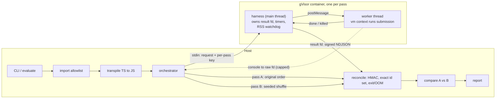

# ts-sandbox-harness

[](https://github.com/mhm655/recreate/actions/workflows/sandbox.yml)

The execution layer of a larger tool. That tool captures a real TypeScript function's behaviour as a fixed test suite, with the original implementation as the oracle, then grades a from-scratch rewrite against that suite.

This repo is **only** the sandbox and execution harness. It takes a function and a list of inputs, runs the function once per input inside an isolated sandbox, and returns each result in a lossless tagged encoding. Every failure comes back as a structured report, never as a crash or a hang of the calling process.

Also here: the static analyzer that describes a function's parameters, a basic input generator built on top of it, the evaluator that grades a rewrite against a captured oracle using the same generated suite, mutation testing (checks whether a generated suite is actually strong enough to catch a wrong rewrite), and the challenge data model that freezes all of that into a single, self-contained, JSON-safe artifact so grading never again needs the oracle's source.

A small local demo UI lives in [`ui/`](ui/README.md) -- a separate package that consumes this repo as an ordinary dependency, exactly the way any other consumer would. It runs against `LocalRunner` (no isolation) and exists to drive the pipeline visually, not to grade untrusted code.

---

## Security model

Each layer has one job. Two of them are **not** security boundaries, and the code says so wherever it touches them.

| Layer | Job | Security boundary? |
|---|---|---|
| **Static import allowlist** (host) | Reject module references outside an explicit allowlist before any container exists | No. It gives early, readable errors. The global-identifier check is a best-effort blocklist and is trivially bypassed. |
| **gVisor container** (`runsc`) | Isolate untrusted code from the host kernel: no network, read-only rootfs, noexec tmpfs, non-root, `cap-drop=ALL`, `no-new-privileges`, seccomp, memory/CPU/pid cgroups | **Yes. This is the boundary.** |
| **Seccomp profile** | Allowlist of syscalls. `clone` is allowed only for threads, so glibc `fork()` and libuv (and so `child_process`) can't create a process. `clone3` has to be allowed under gVisor and can't be filtered, so a raw `clone3` from native code isn't covered | Yes, defence in depth under gVisor |
| **Worker thread** | *Interruptibility.* A synchronous `while(true){}` never yields, so no timer on its own thread can fire. The parent thread calls `worker.terminate()` | **No.** It shares the process, its file descriptors and its address space |
| **`vm` context** | *Realm hygiene.* Fresh intrinsics, no `require`/`process`/timers, string code generation disabled. Prototype pollution can't corrupt the encoder or message plumbing | **No.** `vm` is not a sandbox |
| **Result-channel HMAC + id reconciliation** (host) | Stop a submission from fabricating its own results | No. It protects the integrity of the *report* (see [Known limitations](#known-limitations)) |



### Why each pass gets a fresh container

Both passes run the whole test list, pass A in the original order and pass B in a seeded shuffle. Each pass gets **its own container and its own worker**, so state can't leak between passes through module scope, prototypes or the tmpfs. The two passes run **concurrently** (`Promise.all`), not one after the other -- nothing about pass B depends on pass A's results, only on the seed, so there is no reason to pay the sum of both passes' wall time instead of the max of the two.

Within a pass, one worker runs every test **on purpose**. Module-level counters, memo caches and prototype pollution are *meant* to persist between tests there, because that leakage is exactly what comparing the two passes detects. Any test whose outcome or post-call arguments differ between passes sets the verdict to `nondeterministic`. The report records no single answer for it.

---

## Setup

### Requirements

- Node ≥ 20 on the host (developed on Node 26)
- **A Linux host** with Docker Engine and gVisor. `runsc` doesn't run on Windows or macOS. Docker Desktop's VM doesn't support registering custom runtimes, so use a Linux machine or a Linux VM running its own `dockerd`.

### gVisor setup (one time, Linux)

1. Install `runsc` by following <https://gvisor.dev/docs/user_guide/install/>.
2. Register it with Docker **with OCI seccomp enabled**. By default gVisor *ignores* the seccomp profile passed by `docker run`. Its own syscall interception still protects the host, but `docker/seccomp.json`, including the no-process-creation rule, won't be enforced. In `/etc/docker/daemon.json`:

   ```json
   {
     "runtimes": {
       "runsc": {
         "path": "/usr/bin/runsc",
         "runtimeArgs": ["--oci-seccomp"]
       }
     }
   }
   ```

   Use the path from `which runsc`, and check the flag name against the gVisor docs for your version.
3. Restart Docker:

   ```bash
   sudo systemctl restart docker
   ```

### Bring-up check

```bash
./scripts/check-sandbox.sh
```

The script builds everything, then:
- runs `tsbox verify-isolation`, which probes the isolation claims from **inside** a container launched with the production flags: non-root, read-only rootfs, no network, process creation blocked, worker threads still working, gVisor kernel;
- runs the examples;
- runs the full hostile suite against Docker.

Run it on every new host. Misconfigured seccomp and a missing `--oci-seccomp` both **fail open**, so only this check will catch them.

### Development without gVisor

```bash
npm install
npm test
```

`npm test` uses `LocalRunner`, which runs the harness as a plain child process. **It provides no isolation.** It exists so worker termination, heap caps, the watchdog, encoding and reconciliation can all be tested on a workstation. Every report it produces is stamped `isolated: false`, and the CLI refuses it without `--unsafe-local`.

---

## Usage

```bash
npm run build
npm run image    # builds ts-sandbox-harness:latest

node dist/src/cli.js check --source examples/escape.ts
node dist/src/cli.js run   --source examples/slugify.ts --tests examples/slugify.tests.json
node dist/src/cli.js run   --source examples/counter.ts --tests examples/counter.tests.json --json
```

The test input file is plain JSON:

```json
{ "entryName": "slugify",
  "tests": [ { "id": "basic", "args": ["Hello World"] },
             { "id": "nan",   "args": ["x", "@@NaN"] } ] }
```

JSON can't express some values, so these sentinel strings stand in for them: `"@@NaN"`, `"@@Infinity"`, `"@@-Infinity"`, `"@@-0"`, `"@@undefined"`. Write `"@@@@x"` for a literal `"@@x"`. From code, call `evaluate()` with real JS values instead.

```ts
import { evaluate, DockerRunner } from 'ts-sandbox-harness';

const report = await evaluate({
  source,                                   // TypeScript
  tests: [{ id: 't1', args: [NaN, -0] }],   // real values
  runner: new DockerRunner(),
});
```

A test input built this way can also carry a callback argument, via `recordCalls` (see decision #6 below for what it can and can't do):

```ts
import { evaluate, recordCalls, DockerRunner } from 'ts-sandbox-harness';

const cb = recordCalls((x: number) => x * 2, [[1], [2], [3]]);
const report = await evaluate({
  source,                                        // e.g. `arr.map(cb)`
  tests: [{ id: 't1', args: [[1, 2, 3], cb] }],
  runner: new DockerRunner(),
});
```

### Reading a report

`verdict` says whether the **run is valid**, not whether the function is correct. Comparing against an oracle belongs to the evaluation layer that sits on top of this one.

| verdict | meaning |
|---|---|
| `ok` | Both passes completed, reconciled cleanly and agreed. `results` holds one result per test. A test that timed out in both passes still counts as `ok`: it is consistently a timeout. |
| `nondeterministic` | Results depended on execution order. `determinism.divergences` lists each difference. `order_sensitive` is a real disagreement; `flaky_resource` means one side hit a timeout or memory cap. `results` is empty. |
| `rejected` | Static analysis or transpilation refused the source. No container was started. |
| `failed` | A pass didn't produce a trustworthy, complete result set. See each `passes[].status`. |

Pass statuses, in order of precedence: `sandbox_error`, `integrity_violation` (garbage, forged, duplicate or unexpected lines on the result channel), `resource_limit_exceeded` (container OOM, SIGKILL, host timeout), `incomplete` (missing results, no end-of-pass marker), `ok`.

Each test's `outcome` is one of:
- `return` with an encoded value
- `thrown` with `errorClass`, a normalised `message`, and `value` when a non-Error was thrown
- `timeout`
- `resource_limit` (`memory` or `worker_died`)
- `harness_error`

`argsAfterCall` is the encoded argument list *after* the call. `consoleOutput` is truncated and never part of any comparison.

---

## Limits

Limits are layered, so whichever layer trips first reports most specifically. The container is the backstop behind all of them.

| Limit | Default | Enforced by | Reported as |
|---|---|---|---|
| Per-test wall clock | 1 s | harness timer → `worker.terminate()` | outcome `timeout`; a fresh worker continues the pass |
| Per-pass wall clock | 30 s | harness timer | `sandbox_pass_timeout` problem, remaining tests missing → pass `incomplete` |
| Per-submission wall clock | 120 s | host; `docker kill` on overrun | pass `resource_limit_exceeded` / `submission_timeout` |
| Worker V8 heap | 64 MB old + 16 MB young | `resourceLimits` on the worker | outcome `resource_limit: memory` |
| Process RSS (off-heap, e.g. ArrayBuffers) | 192 MB | watchdog in harness main thread, 10 ms poll | outcome `resource_limit: memory` |
| Container memory (no swap) | 256 MB | cgroup | pass `resource_limit_exceeded` + `container_oom` |
| CPU | 1 CPU | cgroup (throttles; the timeouts catch the effect) | via timeouts |
| Tasks (threads + processes) | 128 | `--pids-limit` | seccomp already blocks processes; backstop |
| Console capture | 8 KB/test, 256 KB raw | harness | truncated with a marker |
| Result payload | 8 MB | host reader + parser | `result_channel_truncated` → pass not `ok` |
| Encoded value size | 20k nodes, depth 32, 16 KB strings | encoder | `{t:'truncated'}` markers |
| Source size | 256 KB | import guard | `source-too-large` |

The container memory limit sits above the RSS watchdog, and the watchdog above the V8 heap cap, so the most specific layer trips first. Under gVisor, sentry overhead counts against the cgroup. If legitimate runs get OOM-killed, raise `--memory-mb` and keep `maxProcessRssMb` below it.

---

## Static analyzer

`tsbox analyze` describes the function under test for the input generator. It runs on the host and **never executes the source**.

```bash
node dist/src/cli.js analyze --source examples/slugify.ts          # summary
node dist/src/cli.js analyze --source examples/slugify.ts --json   # full FunctionAnalysis
```

- **Types come from the TypeScript checker,** not from reading annotations as text. So aliases, interfaces, enums, generic constraints, utility types (`Partial`, `Pick`, `Record`), overloads, and types inferred from defaults (`limit = 48`) resolve the way the compiler sees them. Each parameter gets a JSON `TypeShape` (`src/analyzer/types.ts`) and keeps the checker's own rendering of the type in `text`.
- **Generatability.** Parameters the generator can't produce are:
  - *blockers* when required: callbacks, class instances, promises, generator functions;
  - *always omitted* when optional;
  - *weakly typed* when they're `any`, `unknown` or unconstrained generics.
- **Nondeterminism.** It lists calls to `Date.now()`, `new Date()`, `Date()`, `Math.random()`, `performance.now()` and `crypto.*`, ignoring deterministic forms like `new Date(ms)` and local shadows.
- **Module state.** It lists top-level bindings and containers that the function *writes to from inside a function body*: reassigned `let`s, `Map`/`Set`/array/object mutation. Read-only lookup tables and module initialisation aren't flagged. These are hints; the harness's two-pass run is the authoritative check.
- **Same screening as the harness.** Analysis applies the import allowlist and the same entry-point rules, so it never describes a function the sandbox would refuse, or a different function from the one it would run.
- **Can't read the disk.** The compiler host serves only the in-memory submission and TypeScript's ES2022 lib declarations. Even an allowlisted import comes back as an unresolved type; there's a test proving a real file on disk isn't read. There's no DOM or `@types/node`, matching the sandbox realm.
- **Isolated.** The CLI uses `analyzeIsolated`, which runs the checker in a worker thread with a timeout and heap cap. TypeScript's type system is Turing-complete, so a hostile source can make the checker spin; this contains that.

---

## Input generation

`src/generator/` turns a `FunctionAnalysis` into test inputs for `evaluate()`. It runs on the host, reads only the analyzer's structural output, and never executes the original or the submission.

```bash
node dist/src/cli.js generate --source examples/slugify.ts --seed 5              # summary
node dist/src/cli.js generate --source examples/slugify.ts --json               # {entryName, tests}
node dist/src/cli.js generate --source examples/slugify.ts --out tests.json     # feed straight into `run --tests`
```

- **One-at-a-time, not a cross product.** For `n` parameters with a handful of representative values each, trying every combination is `prod(|values|)` -- unusable past two or three parameters. The generator instead fixes every parameter at one "typical" value and sweeps one parameter at a time through its whole value set, giving `sum(|values|)` tests. It also emits a `minimal` call with trailing optional arguments omitted, and, for a rest parameter, calls with zero/one/several extra arguments. This deliberately does not test interactions between two edge cases in different parameters -- this is a fixed-suite oracle grader, not a fuzzer; the harness's ordered/shuffled double run is what actually proves a submission, not the size of the suite.
- **Values are edge-first.** `valuesFor` (`src/generator/values.ts`) returns things like `''`, long strings, `0`, negative numbers, `NaN`/`Infinity`/`-Infinity`, empty/singleton containers, and an invalid `Date`, not just one "normal" example -- the point of a fixed suite is to catch a rewrite that only handles the easy inputs.
- **Deterministic.** A seeded PRNG (`src/generator/rng.ts`) drives every choice, so the same source and seed always produce the same suite.
- **Refuses exactly what the analyzer would refuse.** `generateTests` checks `generatability.generatable` up front and returns the blockers as the reason, never attempting to fabricate a callback, a `Promise`, or a class instance. A shape the analyzer marks merely weak (`any`, `unknown`, an unconstrained generic, or `recursive`, its own cut-off marker for a self-referential type) gets a small set of generic fallback values instead of being refused -- refusing there would silently narrow what the harness can grade beyond what the analyzer itself decided.
- **The CLI's plain-JSON test format is a strict subset of what the generator can produce.** `--tests` files (see Usage) only round-trip primitives, plain arrays/objects, and the four numeric-sentinel specials. `Date`, `Map`, `Set`, `RegExp`, typed arrays and `bigint` -- all things a real signature can legitimately require -- have no representation there. `tsbox generate` reports and skips any test that needs one rather than writing something that looks valid but isn't; call `generateTests` + `evaluate()` directly from the JS API to run those.
- **The generator produces a *plausible* set of edge cases, not a *proven-adequate* one.** (Concretely: an earlier version of the string edge-case list had no mixed-case example, so a rewrite that silently dropped `.toLowerCase()` passed a full generated suite undetected, until a real end-to-end grading run against a deliberately buggy rewrite surfaced the gap.) "Mutation testing" below is what actually validates a suite's strength; a generated suite passing every grading run is not the same claim as a generated suite having a high mutation score, and the two are worth checking separately.

---

## Evaluator

`src/evaluator/` grades a rewrite against a captured oracle, running both through `evaluate()` against the *same* test list and diffing the results. It runs on the host; every actual execution still goes through the same sandboxed, two-pass pipeline as any other submission -- this layer only decides what "correct" means once both reports come back.

```bash
node dist/src/cli.js grade --oracle original.ts --rewrite candidate.ts --tests tests.json
```

`tests.json` can be a file `tsbox generate --out` wrote, or hand-written in the same format as `run --tests`.

- **The oracle is graded too, implicitly.** `gradeSubmission` runs the oracle through `evaluate()` first. If its own verdict isn't `ok`, grading stops there with `oracle_invalid` and the rewrite is never even run -- an order-sensitive "oracle" has no single right answer to grade against (decision #1), and there is nothing useful to say about a rewrite compared to a source that itself couldn't be evaluated.
- **Inputs the oracle times out on are dropped, not scored either way** (decision #4). Nothing here can tell a rewrite that answers fast and correctly from one whose fast wrong answer never happened to time out, if the oracle itself never produced a real value on that input to compare against. Dropped ids are reported separately (`GradeReport.droppedTestIds`) rather than silently absorbed into the score.
- **A rewrite that fails its own two-pass run never gets diffed per test.** If the rewrite's own `evaluate()` verdict isn't `ok` (rejected by static analysis, order-sensitive, or an incomplete run), the whole grade is `rewrite_invalid` with the reason attached -- there is no single result set to compare item-by-item.
- **Matching rule.** A `return` matches on the canonical form of the encoded value (structural equality, tag-for-tag). A `thrown` matches on error class plus normalised message, not exact wording (decision #3). Anything else -- a timeout, a resource limit, a harness error, or a `return`/`thrown` type mismatch -- is always a mismatch; the rewrite didn't produce a real answer to compare.

---

## Mutation testing

`src/mutator/` answers the question the generator and evaluator can't: *is a given test suite actually strong enough to catch a wrong rewrite?* A suite that only ever probes "normal" inputs can score a perfect `passed` against a rewrite with a real bug, simply because nothing in the suite happens to exercise it. `runMutationTests` checks for exactly that, by generating small syntactic variants of the oracle -- mutants -- and confirming the suite tells each one apart from the real function.

```bash
node dist/src/cli.js mutate --source examples/slugify.ts --tests tests.json
```

- **Mutants are single-token edits, not re-written logic.** `generateMutants` (`src/mutator/mutate.ts`) parses the source (never executes it) and splices the original text at one relational/equality/arithmetic/logical operator, boolean literal, or numeric literal at a time: `<` becomes `<=`, `&&` becomes `||`, `true` becomes `false`, `48` becomes `49`. One mutant per site, so a surviving mutant points at exactly one thing the suite missed.
- **The oracle runs through `evaluate()` exactly once,** reused across every mutant (`src/evaluator/compare.ts`, shared with `gradeSubmission`) -- an unchanged oracle source has no reason to be re-evaluated per mutant.
- **A mutant is "killed"** if the suite's results diverge from the oracle's the same way a rewrite's would (same matching rule as grading), *or* if the mutant itself comes back order-sensitive or incomplete -- that is itself a real, detectable difference from an oracle that passed the identical check. It is **"survived"** if the mutant produces an identical, `ok` result set: the suite cannot tell it apart from the real function. A mutant that fails to even transpile or gets rejected by static screening is **"inconclusive"** and excluded from the score entirely -- that outcome says nothing about the suite.
- **Equivalent mutants are a known, unavoidable category, not a bug.** Some single-token edits cannot change any observable output no matter what the suite tests -- e.g. swapping `<` for `<=` in a clamp/min/max-style ternary at the exact tie point, where both branches return the same value. These mutants can never be killed and lower the score for reasons that have nothing to do with suite quality. This implementation makes no attempt to detect them (that is close to undecidable in general); a low score is a prompt to look at *which* mutants survived, not an automatic suite verdict.
- **This is why the layer exists, demonstrated on this repo's own example:** `tsbox generate` against `examples/slugify.ts` produces a 12-test suite that passes a completely correct rewrite -- but mutation-testing that exact suite scores only **50%**, naming the surviving mutant as the default parameter's `48 -> 49`. None of the generator's edge-case strings happen to be long enough for the truncation default to matter, so a rewrite that silently used the wrong default length would pass undetected. The suite isn't wrong, it's just not as strong as its all-`ok` grading result would suggest.

---

## Challenge data model

`src/challenge/` is this repo's opening sentence made literal: *"captures a real TypeScript function's behaviour as a fixed test suite, with the original implementation as the oracle."* A `Challenge` is that capture -- a single, self-contained, plain-JSON object -- and `gradeAgainstChallenge` grades a rewrite against it without ever touching the oracle's source again.

```bash
node dist/src/cli.js capture --source examples/slugify.ts --mutate --out challenge.json
node dist/src/cli.js grade --challenge challenge.json --rewrite candidate.ts
```

- **`captureChallenge` runs the oracle exactly once,** at capture time: analyze -> generate -> `evaluate()` the oracle -> freeze its own outcomes as `expected`. Refuses exactly like `gradeSubmission` does if the oracle isn't generatable or isn't deterministic, and drops (and records) any input the oracle consistently times out on (decision #4) -- same rules, same reasons, applied once instead of on every grading run.
- **A `Challenge` needs nothing but itself to grade against.** `ChallengeTest.args` and `.expected` are stored as `EncodedValue`/`Outcome` (src/encoding.ts, src/protocol.ts) -- the same tagged, lossless forms already used to cross the sandbox boundary -- so the whole object is `JSON.stringify`-able with no further lifting, and grading a rewrite never re-runs, re-parses, or even needs `oracleSource` (kept only for provenance/re-capture; a distributed Challenge file could have it stripped).
- **`id` is a content hash of `{entryName, allowedModules, tests}`,** not of the oracle's source text. Two oracles that are textually different but behaviourally identical (`x * 2` vs. `x + x`) capture to the *same* id; the same source captured twice at the same seed always does. Re-capturing after the generator improves produces a different id exactly when the tests actually differ.
- **Mutation testing is optional at capture time** (`--mutate` / `mutationTest: true`), stored as a compact summary (score, and just the survived mutants' descriptions/locations) rather than the full mutation report -- it's a real cost (one `evaluate()` per mutant) worth paying once per challenge, not implied by capturing one.
- **A quality gate is optional too** (`--min-mutation-score <pct>` / `minMutationScore` in `[0,1]`): refuses to capture a challenge whose mutation score falls below the threshold, instead of silently producing a challenge that looks identical to a strong one downstream. Setting it implies running mutation testing even if `--mutate`/`mutationTest` was never set -- asking for a floor on the score is asking to measure it. A source with nothing mutable (no operator or literal for `generateMutants` to touch) has no score to fall below and passes the gate: there is nothing a suite could have missed.
- **This surfaced a real, separate generator bug while it was being written:** `generateTests` produced exactly one test for any zero-parameter function. The harness's determinism check works by reordering *multiple* calls within a pass and comparing; with a single call there is nothing to reorder, so a stateful zero-parameter function (a counter with no arguments to vary) always looked deterministic no matter how stateful it actually was. `captureChallenge`'s own test suite caught this directly -- capturing a deliberately stateful zero-arg oracle didn't get refused as it should have. Fixed in `src/generator/generate.ts` to generate several identical no-argument calls instead of one.

---

## Design notes

### Result channel

- **Separate descriptor.** Results never share a descriptor with untrusted console output. Locally the harness writes results to a real fd 3 and console to fd 1. `docker run` forwards exactly three descriptors, so in the container results go on fd 1 and all worker stdio goes to fd 2 (`SANDBOX_RESULT_FD=1`). In both cases only the trusted main thread writes to the result descriptor.
- **Signed lines.** Each line is `<hmac-sha256> <json>`. The key is fresh for each pass, arrives on stdin, and lives only in the main thread's JS heap: never in env, `workerData` or on disk. The worker can still write to the fd, because fds are process-wide. It can't sign what it writes.
- **Minimal parsing.** The host uses plain `JSON.parse` under a byte cap and nothing more capable. A partial final line from a container killed mid-write counts as truncation, not tampering.
- **Exact reconciliation.** The returned test-id set must match the expected one exactly: nothing missing, nothing extra, no duplicates. A partial result set is a failed run. "Every test that came back passed" is exactly what an attacker would try to engineer.

### Tagged encoding

`JSON.stringify` loses `NaN`, `±Infinity`, `-0` and `undefined`, flattens `Date`, and throws on cycles and `bigint`. `src/encoding.ts` tags every node instead. It round-trips all of those, plus sparse-array holes, `Map`/`Set`, typed arrays, errors (class, normalised message, own extra props, never the stack), null-prototype objects, cycles, and aliasing between arguments.

The encoder is **realm-agnostic**: it uses `Object.prototype.toString` and own descriptors, never `instanceof` or inherited properties. It also **never invokes getters**. Test arguments are decoded **into the sandbox realm**, using intrinsics captured before any user code ran, so `x instanceof Array` behaves as the function's author expects.

### Transpiling on the host

The host already parses the untrusted source with the TypeScript compiler for the allowlist check, so emitting JS there adds little attack surface. In return, the image ships no `node_modules`, the worker's heap budget goes to the submission, and a replacement worker starts in milliseconds.

### Deferred microtasks

`Promise.resolve().then(() => { while (true) {} })` returns instantly. If the worker replied right away, the next test would be blamed for the hang. So before reporting, the worker yields once to the macrotask queue, which only happens after every queued microtask has run. The hostile suite covers this case.

### Import allowlist

`DEFAULT_ALLOWED_MODULES` in `src/import-guard.ts` is the whole policy for `checkSource` used standalone: one array, **empty by default**, matched exactly, with no wildcards and no implied subpaths.

The allowlist only permits a module *statically*. Making an allowed module *available* at runtime is a separate step -- see "Vendored dependencies" below. `evaluate()`, the harness entry point, defaults `allowedModules` to `VENDORED_MODULES` rather than the empty default, so a submission can use anything actually vendored without extra configuration; pass `allowedModules` explicitly (e.g. `[]`) to narrow that.

### Vendored dependencies

A submission can `import` a small, explicit set of vetted npm packages -- `lodash-es`, `date-fns`, `ms` -- listed in `VENDORED_MODULES` (`src/bundle.ts`). Adding one there is a supply-chain decision, not a config toggle: the package's code runs, inlined, as part of every submission that imports it, so vet it (and its own dependencies) first.

**How it stays consistent with "no node_modules in the image, no runtime require":** after the host transpiles a submission to CommonJS (as it always has), `bundleSubmission` runs esbuild over that output with `bundle: true`, resolving vendored specifiers against the *host's* `node_modules` and inlining them. The worker never sees a `require` of anything real -- it gets one self-contained script, same as before this feature existed. A test (`every vendored module is actually installed`, in `test/bundle.test.ts`) fails the build if `VENDORED_MODULES` ever lists something not actually in `package.json`.

Only modules that pass `checkSource`'s allowlist reach the bundler at all, so a specifier that isn't in `VENDORED_MODULES` is rejected before any bundling is attempted -- there is no path where the bundler is asked to resolve something arbitrary.

**Known cost:** `lodash-es`'s own module graph is not fully tree-shakeable by esbuild (its internals share state through a single `lodash.js` object), so importing even one function currently inlines most of the library (tens of KB). That's a size/startup cost, not a correctness or security one; a future version could switch to per-function `lodash-es/<fn>.js` imports or a different vetted library if that cost matters.

**One realm quirk this surfaced:** `lodash-es`'s root-detection code falls back to `Function('return this')()` when it can't find `global` or `self`. The vm context (`src/sandbox/worker.ts`) disables string code generation, so that fallback would throw. The fix is a one-line alias, `globalThis.global = globalThis`, added to the context before any submission code runs -- it does not add a capability, since `global` here is just another name for the same restricted realm.

**One interop bug adding `date-fns` and `ms` surfaced:** `date-fns` (a real ES module) worked immediately; `ms` is legacy CommonJS (`module.exports = fn`, no `.default`), and `import ms from 'ms'` transpiled into code reading a `.default` property that plain CJS modules don't have -- it threw `"is not a function"` at runtime despite transpiling and bundling cleanly. `src/transpile.ts` never set `esModuleInterop`, so TypeScript's usual handling for exactly this case (wrapping a plain CJS export as `{ default: ... }` via its `__importDefault` helper) never ran. Fixed by enabling it there; verified against both a named-export (`lodash-es`, `date-fns`) and a default-import (`ms`) dependency so the fix covers both shapes, not just the one that broke.

---

## Hostile suite

`test/hostile-pipeline.test.ts` runs each case through the full pipeline.

| Attack | What stops it | Verified locally | Verified on gVisor |
|---|---|---|---|
| `while(true){}` | per-test timer → `worker.terminate()`; fresh worker continues | ✅ | run `check-sandbox.sh` |
| Hang deferred into a microtask | macrotask yield before reply; timeout blamed on the right test | ✅ | ″ |
| Unbounded array growth | worker V8 heap cap | ✅ | ″ |
| Off-heap `Uint8Array` growth | RSS watchdog | ✅ | ″ |
| Allocation outrunning every in-sandbox cap | container cgroup → `resource_limit_exceeded` | reconciliation unit-tested | Docker-only test |
| `require('child_process')`, aliased, string-built, via `globalThis`, `import()`, `eval`, `process.binding` | static allowlist, rejected before launch (asserted: no sandbox is started) | ✅ | n/a (host-side) |
| `(function(){}).constructor('return process')()` and similar, which *pass* static analysis | vm context with string code generation disabled → `EvalError` | ✅ | ″ |
| All of the above with static analysis **bypassed** | no `require`/`process`/`module` in the realm | ✅ | ″ |
| Prototype pollution | persists within a pass, not across passes, never reaches the host, can't hijack the encoder; flagged `nondeterministic` | ✅ | ″ |
| Returns `NaN`, `±Infinity`, `-0`, `undefined`; throws non-Errors | tagged encoding, both into and out of the sandbox | ✅ | ″ |
| Mutates its arguments | `argsAfterCall` | ✅ | ″ |
| Module-level counter, memo cache | shuffled second pass → `nondeterministic` | ✅ | ″ |
| Garbage, unsigned forgeries, dropped or duplicated lines, **and a signed extra entry with a leaked key**, all written to the real result fd from inside the sandbox process | HMAC + exact id reconciliation | ✅ | tamper tests are local-only by design |

The tamper tests inject a `--require` preload into the sandbox process. It attacks the real result descriptor while the real harness runs, and each test also asserts the harness completed, so a crashed preload can't pass for a caught attack.

### Verification status

- **Windows 10 / Node 26:** the full suite via `LocalRunner`, plus the CLI paths.
- **CI, GitHub Ubuntu runners with gVisor `release-20260907.0` and `--oci-seccomp`** ([workflow](.github/workflows/sandbox.yml)):
  - the full local suite;
  - `verify-isolation` from inside a production-flagged container: non-root, read-only root mount, no network egress (`EPERM`), process creation blocked (`EPERM`), worker threads working, gVisor kernel;
  - both examples;
  - the hostile suite against Docker, including the container OOM test.

  The tamper and host-kill tests run only under `LocalRunner`, by design.
- **What CI turned up:** gVisor with `--oci-seccomp` breaks Node under any profile that refuses `clone3`, Docker's default included. The profile now allows `clone3`, trading away some coverage (see the profile's comments). `scripts/diagnose-seccomp.sh` reproduces the finding and runs automatically in CI if the isolation checks ever fail.

---

## Known limitations

- **The result-channel key is not a hard boundary.** The key lives in a thread of the same OS process as the untrusted code, and code that fully escapes the vm context could read it back from `/proc/self/mem`. With the key, an attacker can **substitute** a plausible result for a real one, and reconciliation can't detect that (extra and duplicate entries are still caught; see the `extra-signed` test). That's acceptable only because gVisor is the boundary and the escape has to happen first. The robust fix is to run the submission in a **child process** instead of a worker thread, so the result descriptor can be withheld entirely. That departs from this session's spec, so it's future work.
- **gVisor fails open if misconfigured.** Without `--oci-seccomp`, the seccomp profile is silently ignored. Run `verify-isolation`.
- **Node's `--permission` model was considered and rejected.** Worker threads need `--allow-worker`, which Node warns "could invalidate the permission model".
- **Base images are tag-pinned, not digest-pinned.** Pin both `FROM` lines to `@sha256:` digests for production.

## Decisions for the next layers

Decided (2026-09-16):

1. **An order-sensitive original is rejected as an oracle,** with the divergences as the reason. A per-test fresh-worker mode is possible later if real functions need it.
2. **Time and randomness will be frozen or seeded inside the sandbox realm,** so functions using `Date.now()` or `Math.random()` become testable. *Not implemented yet:* until then the analyzer lists these call sites and the harness flags such functions `nondeterministic`.
3. **Thrown errors match on error class plus normalised message.** Class-only matching can be a per-challenge option.
4. **Inputs on which the original times out are dropped** during generation instead of being kept as expected timeouts.

5. **Real dependencies are supported through host-side bundling, not a runtime resolver.** A short vetted list (`VENDORED_MODULES`, currently `lodash-es`) is inlined into the transpiled submission by esbuild before it reaches the worker, so the sandbox still ships no `node_modules` and `require` still throws in the realm. See "Vendored dependencies" above. Extending the list is a per-package vetting decision, not a mechanism change.
6. **A live function argument still cannot cross into the sandbox -- there is no channel to call back out to it -- but a *bounded, pre-computed record* of what it did for a known set of inputs now can.** `recordCalls(fn, inputs)` (`src/encoding.ts`) calls `fn` once per input right now, on the host, and returns a function that -- once encoded as a test argument and decoded inside the sandbox -- replays the matching recorded outcome (return value or thrown error) for a call whose arguments match, and throws the same loud, attributable "cannot be reconstructed" failure as before for any call outside that table. This covers `map`/`filter`/`forEach`-style callback parameters, where the caller already knows exactly what elements the callback will be called with; matching is on however many arguments each recorded entry has, not full arity, since those array methods call their callback as `(element, index, array)` and recording just the element is normally what's meant. It does *not* cover a callback the submission calls with values it computes itself (there is nothing to record those against) -- that still fails loudly, which is the right behaviour for an argument that was never going to be safe to fabricate an answer for.
   Reachable only through the JS API's hand-authored `TestCase[]` (`evaluate()`/`gradeSubmission()`): `generateTests` still cannot invent a meaningful callback implementation on its own, so a required function-typed parameter is still a generator blocker, and `captureChallenge` -- which always builds its test list via `generateTests` -- never produces one either. A class instance argument still decodes to a plain object with `ctor` recorded and no methods; attaching a `recordCalls`-wrapped function as an own property before passing the instance works today with no further changes (it's encoded exactly like a bare callback argument, since object properties are encoded recursively), but there's no dedicated ergonomic helper for that yet.

---

## Layout

```
src/
  encoding.ts          tagged encoder/decoder (host + sandbox)
  channel.ts           HMAC framing + capped parsing of the result channel
  protocol.ts          wire types and default limits
  import-guard.ts      static allowlist + entry-point resolution (host)
  transpile.ts         TS -> JS (host)
  bundle.ts            inlines vendored dependencies into the submission (host)
  sandbox/harness.ts   container main thread: result fd, timers, watchdog, worker supervision
  sandbox/worker.ts    worker thread: vm context, runs one test at a time
  host/runner.ts       runner interface + LocalRunner (NO isolation)
  host/docker-runner.ts gVisor container runner + verify-isolation probes
  host/orchestrator.ts two passes, reconciliation, comparison, report
  analyzer/            static signature/type analysis for input generation (host, no execution)
  generator/           input generation from FunctionAnalysis (host, no execution)
  evaluator/           grades a rewrite against an oracle via evaluate() (host)
  mutator/             mutation testing: is a suite strong enough to catch a wrong rewrite? (host)
  challenge/           captures behaviour as a fixed, self-contained, JSON-safe artifact (host)
  cli.ts
docker/Dockerfile, docker/seccomp.json
scripts/check-sandbox.sh
test/                  unit suites, hostile pipeline suite, fixtures, tamper preload
examples/              slugify (clean), counter (stateful), escape (rejected)
ui/                    separate package: small React demo UI + API server (see ui/README.md)
```
